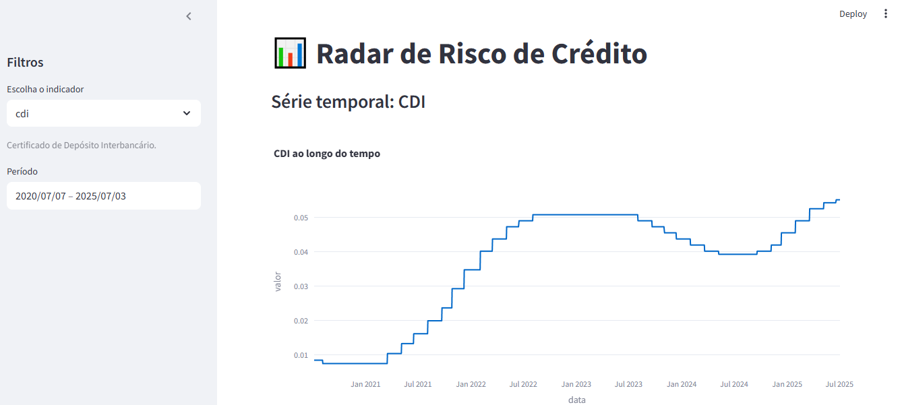

# 📊 Radar de Risco de Crédito

Este projeto implementa um pipeline completo de **engenharia de dados com automação e visualização interativa** para monitoramento de **indicadores econômicos brasileiros**, com foco na avaliação de **riscos de crédito**.

A solução realiza:
- Coleta automática de dados via API do Banco Central (SGS)
- Transformação e limpeza com pandas
- Armazenamento em banco de dados local (SQLite)
- Geração de alertas automáticos com base em tendências detectadas
- Exibição interativa de gráficos e alertas via Streamlit

---

## 🚀 Funcionalidades

- 🔄 Coleta automatizada de indicadores econômicos (SELIC, IPCA, CDI, Dólar)
- 🧼 Padronização dos dados: datas e valores numéricos
- 🗃️ Armazenamento estruturado em SQLite
- ⚠️ Geração de alertas com base em regras de tendência
- 📊 Dashboard interativa com filtro por período e indicador
- 📁 Histórico de alertas salvo em logs

---

## 🧱 Tecnologias Utilizadas

- **Python 3.10+**
- `pandas` – manipulação de dados
- `requests` – consumo de APIs públicas
- `sqlite3` – banco de dados local
- `Streamlit` – interface gráfica e dashboard
- `Plotly` – visualização interativa
- `glob`, `os`, `datetime` – automação e controle de arquivos
- `Git` – versionamento

---

## 📂 Estrutura do Projeto

```
credit_risk_radar/
├── data/
│   ├── raw/               # Dados brutos coletados da API
│   └── processed/         # Dados limpos e tratados
├── db/
│   └── indicators.db      # Banco de dados SQLite
├── logs/
│   └── alertas.txt        # Arquivo com os alertas gerados
├── scripts/
│   ├── fetch_bcb.py       # Coleta dados da API do Banco Central
│   ├── transform.py       # Realiza a limpeza e transformação dos dados
│   ├── load_to_db.py      # Insere os dados tratados no banco de dados
│   └── alert_engine.py    # Motor de regras para gerar alertas
├── dashboard/
│   └── app.py             # Dashboard interativa com Streamlit
├── requirements.txt
└── README.md
```

---

## ⚙️ Como Executar o Projeto

### 1. Clone o repositório
```bash
git clone https://github.com/seu-usuario/credit_risk_radar.git
cd credit_risk_radar
```

### 2. Crie o ambiente virtual e ative (opcional, mas recomendado)
```bash
python -m venv venv
source venv/bin/activate  # Linux/macOS
venv\Scripts\activate     # Windows
```

### 3. Instale as dependências
```bash
pip install -r requirements.txt
```

### 4. Execute a pipeline (coleta → transformação → carga → alerta)

```bash
# Exemplo para o indicador SELIC
python scripts/fetch_bcb.py selic
python scripts/transform.py
python scripts/load_to_db.py
python scripts/alert_engine.py
```

Você pode repetir para `ipca`, `cdi`, `dolar`…

---

### 5. Execute a dashboard

```bash
streamlit run dashboard/app.py
```

Acesse o app em `http://localhost:8501`

---

## 📌 Indicadores Monitorados

| Indicador | Fonte | Finalidade |
|-----------|-------|------------|
| **SELIC** | BCB   | Taxa básica de juros |
| **IPCA**  | BCB   | Indicador oficial de inflação |
| **CDI**   | BCB   | Referência de juros bancários |
| **Dólar** | BCB   | Moeda estrangeira, afeta crédito externo |

---

## ⚠️ Exemplo de Alerta Gerado

```
[2025-07-06 14:30:21] ALERTA: SELIC subiu 3 vezes seguidas! Últimos valores: [10.25, 10.50, 10.75, 11.00]
```

Todos os alertas são armazenados no arquivo `logs/alertas.txt`.

---

## 📈 Prints da Dashboard (opcional)

## 📸 Visão Geral da Dashboard



## 👨‍💻 Autor

**Guilherme Freire**  
Desenvolvedor Python | Engenharia de Dados | Automação & RPA  
[LinkedIn](https://www.linkedin.com/in/seu-usuario)  

---

## 📎 Licença

Este projeto está licenciado sob a **MIT License** – sinta-se livre para usar e evoluir!

---

## 🌟 Quer contribuir?

Pull requests são bem-vindos! Vamos evoluir juntos esse radar.
